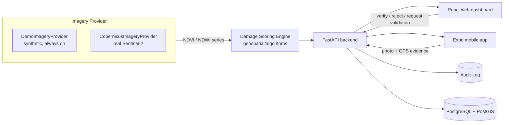

<div align="center">

# 🌾 BantayAni

**Satellite-powered agricultural damage detection and monitoring for the Philippines**

*"Bantay" (watch/guard) + "Ani" (harvest) — watching over the harvest*

[](LICENSE)
[](backend/requirements.txt)
[](backend)
[](apps/web)
[](apps/web)
[](docker-compose.yml)
[](apps/web)

</div>

---

BantayAni combines free Sentinel-2 satellite imagery, remote sensing indices (NDVI/NDWI), and geospatial analysis to help the Philippine Department of Agriculture and its regional, provincial, and municipal offices spot farmland that may have been damaged by typhoons, flooding, drought, landslides, fire, or pest and disease stress — without waiting for every affected farmer to file a manual report.

It's built as a full monitoring workflow, not just a map: an automated detection is only ever a *lead*. It moves through severity scoring, government verification, and optional field validation (with photo and GPS evidence from the field) before anything is treated as confirmed damage.

## ✨ Features

- 🛰️ **Real satellite imagery** — NDVI, NDWI, and cloud statistics pulled live from Sentinel-2 via the free Copernicus Data Space Ecosystem, with true-color before/after images
- 🗺️ **Interactive map** — clustered, filterable view of every detection across the country, down to barangay level
- 📊 **Transparent damage scoring** — a real, reproducible rule-based algorithm scores severity and confidence from the observation series, not a black box
- 🔍 **Farm inspection view** — swipe/side-by-side before-and-after imagery, a vegetation index timeline, and full detection history per farm
- ✅ **Verification workflow** — detection → assessment → government verification → field validation are kept as distinct, auditable stages
- 🔐 **Real authentication & role-based scoping** — JWT-based login; regional, provincial, and municipal officers only ever see detections in their assigned area
- 🔔 **Automated alerts** — high and critical detections route notifications to the relevant officer (and to national admins for anything critical)
- 📝 **Full audit log** — every verification decision and data import is recorded and reviewable
- 📥 **Bulk farm import** — CSV import with per-row validation, duplicate detection, and its own audit trail
- 📱 **Field data capture** — a React Native/Expo mobile app lets field officers submit photo + GPS evidence, visible on the web dashboard
- 📴 **Installable PWA** — the web app installs to desktop or mobile home screen and keeps working through spotty connections
- 🧪 **Actually tested** — 69 backend tests and a growing frontend suite, run on every change described below

## 📸 Screenshots

> Add screenshots or a short demo GIF of the map, the farm inspection view, and the imagery comparison here — this is the first thing a visitor sees.

## 🧱 Tech Stack

| Layer | Technology |
|---|---|
| **Web frontend** | React 18, TypeScript, Vite, Tailwind CSS, React Router, Leaflet + react-leaflet (marker clustering), Recharts, Vite PWA plugin |
| **Mobile** | React Native, Expo, React Navigation, expo-location, expo-image-picker |
| **Backend API** | FastAPI, Pydantic v2, SQLAlchemy 2, Alembic migrations, python-jose (JWT), bcrypt |
| **Database** | PostgreSQL with PostGIS |
| **Background jobs** | Celery, Redis |
| **Satellite imagery** | Copernicus Data Space Ecosystem — Sentinel Hub Statistical API (NDVI/NDWI/cloud stats) and Process API (true-color rendering) over Sentinel-2 L2A |
| **Geospatial algorithms** | Custom NDVI/NDWI change detection and rule-based damage scoring (`geospatial/algorithms`) |
| **Testing** | pytest (backend), Vitest (frontend) |
| **Infrastructure** | Docker Compose, environment-driven configuration |

## 🏗️ Architecture

BantayAni keeps four concerns deliberately separate, since they're easy to accidentally merge into one status field:

1. **Detection** — what the remote sensing algorithm found in the imagery
2. **Assessment** — the severity, confidence, and estimated affected area calculated from that detection
3. **Verification** — the decision a government reviewer makes after reviewing it
4. **Field Validation** — what personnel confirm in person, with photo and GPS evidence



Both the imagery source and the detection engine sit behind an interface, so a real satellite provider (or, later, a trained ML model) can be swapped in without touching the scoring algorithm, the API shape, or the frontend. See [`docs/architecture.md`](docs/architecture.md) for the full breakdown.

## 📁 Repository Layout

```
bantayani/
  apps/
    web/            React and TypeScript web dashboard
    mobile/         Expo/React Native app for field officers
  backend/
    app/            FastAPI application (auth, farms, detections, imagery, analytics, verification)
    workers/        Background jobs for satellite processing and notifications
    migrations/     Alembic database migrations
  geospatial/
    algorithms/     Change detection and damage scoring
    preprocessing/  Cloud masking, mosaicking, index calculation
    models/         Machine learning models (introduced once training data exists)
  infrastructure/   Deployment and infrastructure configuration
  docs/             Architecture and design documentation
  assets/           Branding and image generation references
```

## 🚀 Getting Started

**Requirements:** Docker & Docker Compose, Node.js 20+, Python 3.11+

```bash
git clone https://github.com/villenaderic/bantayani.git
cd bantayani
cp .env.example .env
docker compose up -d
```

Then apply migrations and seed the demo dataset:

```bash
docker compose exec backend alembic upgrade head
docker compose exec backend python -m app.core.seed_demo
```

The web dashboard runs at `http://localhost:5173`, the API at `http://localhost:8000` (interactive docs at `http://localhost:8000/docs`).

### Demo accounts

Seeding creates six government accounts, all sharing the password `bantayani-demo`:

| Account | Role | Scope |
|---|---|---|
| `admin@bantayani.gov.ph` | National administrator | Everything |
| `gis@bantayani.gov.ph` | GIS analyst | Everything |
| `regional@bantayani.gov.ph` | Regional officer | Region II |
| `provincial@bantayani.gov.ph` | Provincial officer | Isabela |
| `municipal@bantayani.gov.ph` | Municipal officer | Aparri |
| `viewer@bantayani.gov.ph` | Viewer | Read-only, everything |

### Running the frontend on its own

```bash
cd apps/web
cp .env.example .env
npm install
npm run dev
```

With no backend reachable at `VITE_API_BASE_URL`, the interface automatically falls back to a bundled demo dataset and marks itself as such in the header — the whole workflow is explorable with zero setup.

### Enabling real satellite imagery

By default BantayAni runs on deterministic synthetic imagery so it works out of the box with no credentials. To switch a deployment to real Sentinel-2 data, create a free OAuth client in the [Copernicus Data Space Ecosystem](https://dataspace.copernicus.eu/) dashboard and set:

```bash
IMAGERY_PROVIDER=copernicus
COPERNICUS_CLIENT_ID=your-client-id
COPERNICUS_CLIENT_SECRET=your-client-secret
```

If the real provider is ever unreachable, the backend automatically falls back to demo data for that request rather than failing — every API response includes a `source` field, and the imagery viewer shows a live/demo badge, so it's always clear which one you're looking at.

## 🧪 Testing

```bash
# Backend (69 tests: auth, scoping, alerts, audit log, damage scoring, imagery providers)
cd backend
pip install -r requirements.txt -r requirements-dev.txt --break-system-packages
pytest

# Frontend
cd apps/web
npm test
```

`requirements.txt` deliberately excludes `rasterio`, `geopandas`, and `geoalchemy2` (see `requirements-geospatial.txt`) since those need system-level GDAL libraries; nothing in the codebase uses them yet. GDAL is already installed inside the Docker image if you'd rather run tests with `docker compose exec backend` in front of the same commands.

## 📊 Project Status

| Phase | Status |
|---|---|
| 1. Foundation | ✅ Done |
| 2. Farm Intelligence (imagery viewer, real Sentinel-2 imagery) | ✅ Done |
| 3. Automated Detection (NDVI/NDWI, damage scoring) | ✅ Done |
| 4. Government Verification | ✅ Done |
| 5. Analytics | ✅ Done |
| 6. Mobile (field evidence capture) | 🟡 Core flow done, offline sync pending |
| 7. Machine Learning | ⬜ Not started, needs validated real-world detections first |

Full detail on what's built and what's deliberately deferred lives in [`docs/phases.md`](docs/phases.md).

## 🗺️ Roadmap / Ideas for Improvement

Contributions on any of these are very welcome:

- **Per-layer real imagery** — false color, NDVI, water, and damage-mask layers currently still use a generated illustration; only the true-color layer renders a real Copernicus image today
- **Mobile offline support** — background sync and local queuing for field evidence submitted without connectivity
- **Marker clustering & polygons on the mobile map** — currently web-only
- **Machine learning detection model** — `geospatial/models` is scaffolded for this once enough verified detections exist to train on
- **Real cadastral farm boundaries** — boundaries are currently generated to roughly match each farm's stated area rather than sourced from an actual land registry
- **Object storage for media** — field evidence photos and satellite renders currently live on local disk in development; swap in S3/GCS-compatible storage for production
- **CI/CD pipeline** — GitHub Actions to run the backend and frontend test suites, lint, and typecheck on every PR
- **End-to-end tests** — Playwright or Cypress coverage of the verification workflow end to end
- **Filipino localization** — the interface is English-only today
- **WebSocket-based live alerts** — alerts currently rely on polling rather than a push channel
- **Refresh tokens / session expiry UX** — current JWT auth has no refresh flow
- **Designed app icons & branding** — current icons are a generated placeholder; see `assets/prompts/image-generation-prompts.md` for the intended direction

## 🤝 Contributing

Issues and pull requests are welcome. If you're picking up something from the roadmap above, opening an issue first to say what you're working on avoids duplicate effort.

## 📄 License

Released under the [MIT License](LICENSE).

## 🙏 Acknowledgments

- Contains modified Copernicus Sentinel data, accessed via the [Copernicus Data Space Ecosystem](https://dataspace.copernicus.eu/).
- Built with [FastAPI](https://fastapi.tiangolo.com/), [React](https://react.dev/), [Leaflet](https://leafletjs.com/), and [Expo](https://expo.dev/).
